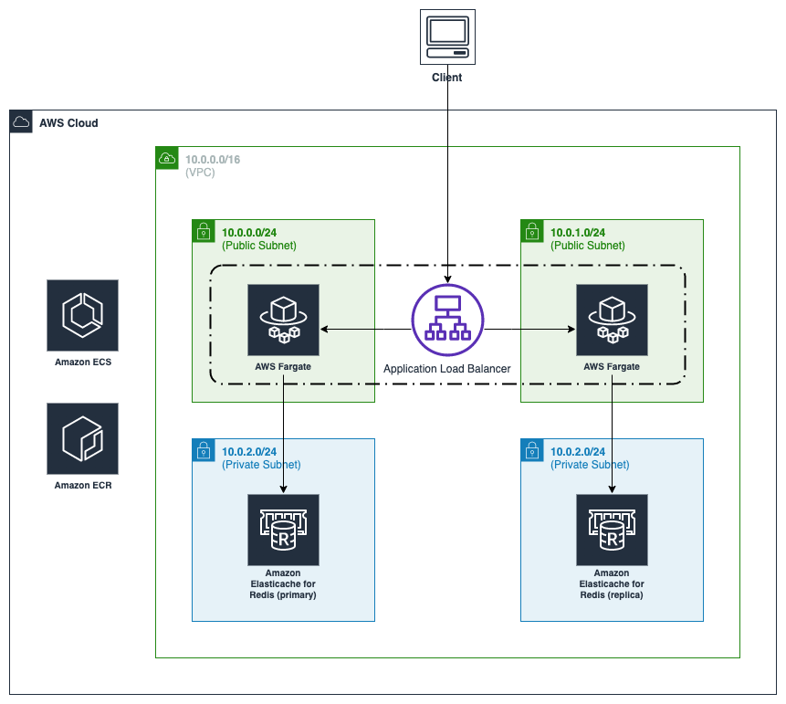
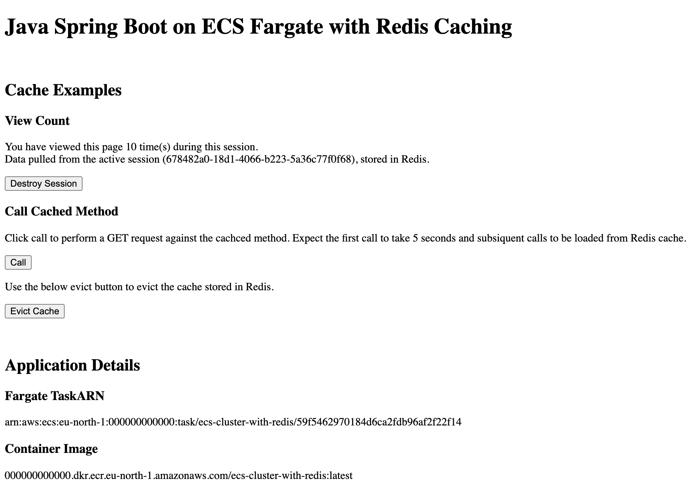

# Java Spring Boot on ECS Fargate with Redis Caching
## Introduction
This sample shows how a Spring Boot application can be deployed on ECS Fargate with Redis Caching Support to persist session data and improve application performance. The solution also provides the necessary templates to automatically provision the required infrastructure using CloudFormation to your desired AWS account.

## Pre-requisite
For the deployment, you must have the following:

- An AWS account. If you don’t have an AWS account, sign up at https://aws.amazon.com.
- [AWS Command Line Interface (AWS CLI)](https://docs.aws.amazon.com/cli/latest/userguide/install-cliv2.html).

## Solution Architecture
The application architecture consists of a single ECS Fargate container and Redis instance with the potential to scale out if required across the two provided private subnets.



## Application Overview
The Spring Boot application provides a basic interface to test the Redis Session Data and Cachable method call capabilities.



### Spring Boot Redis Dependencies

#### Spring Boot Starter Data Redis
The [Spring Boot Starter Data Redis](https://docs.spring.io/spring-data/data-redis/docs/current/reference/html/#reference) dependency provides us with the necessary spring data redis dependency and lettuce-core driver to integrate with our Redis server.
```
<dependency>
	<groupId>org.springframework.boot</groupId>
	<artifactId>spring-boot-starter-data-redis</artifactId>
</dependency>
```

#### Spring session data Redis
The [Spring Session Data Redis](https://spring.io/projects/spring-session-data-redis) allows the application to easily integrate the HttpSession with Redis.
```
<dependency>
	<groupId>org.springframework.session</groupId>
	<artifactId>spring-session-data-redis</artifactId>
</dependency>
```

### Redis Session Data
The sample application provides a "view count" example that updates each time a user of the same session visits the page. The example demonstrates the ability to persist data, even when served by different Fargate containers within the cluster.

### Redis Cacheable
The cacheable example shows the usage of Redis for returning a cached response. The first call the method will take around five seconds to execute whilst a thread sleep is invoked. Subsequent calls will be returned from cache and avoid the need to wait 5 seconds for the same result.

## Deployment

### Local
[Docker Compose](https://docs.docker.com/compose/gettingstarted/) is used to run the project locally as it provides the capability to bring up the application, redis instance, and mock Fargate metadata easily.

Simply run ``` make deploy-local ``` to bring up a local running version of the project. Once running, you will be able to access the sample at `localhost:8080`.

### AWS
Simply run ``` make deploy-aws ``` to create the base infrastructure, push the docker image to ECR and deploy the Java app into ECS. Once completed, visit the ALB FQDN name to access the Java spring boot running on ECS.

## Clean up
To avoid unexpected charges to your account, make sure you [delete your stack](https://docs.aws.amazon.com/AWSCloudFormation/latest/UserGuide/cfn-console-delete-stack.html) after you have finished your testing.

## Security
See the [contributing](CONTRIBUTING.md) file to learn how to contribute to this project.

## License
This library is licensed under the MIT-0 License. See the LICENSE file.